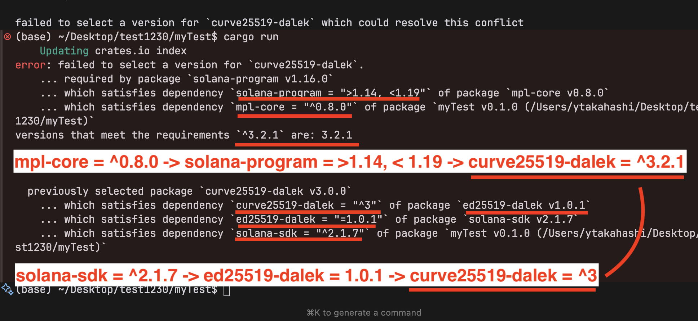

### 1 create a new project

```
cargo new my_project
cd my_project
```

### 2 run the code

`cargo run`

### 3 add dependencies

`cargo add mpl-core`

`cargo add solana-client solana-sdk`



`cargo add mpl-core@0.8.1-beta.1`

### 4 create a rpc client

use RpcClient::new()  
`solana_client::rpc_clilent::RpcClient`

### 5 create a keypair

use read_keypair_file  
`solana_sdk::signature::read_keypair_file`

### 6 create an asset keypair

use Keypair::new()  
`solana_sdk::signature::Keypair`

### 7 create an instruction

use CreateV1Builder::new()  
`mpl_core::instructions::CreateV1Builder`

- asset
- payer
- name
- uri
- instruction

### 8 create signers

use vec![]

### 9 get a last blockhash

use rpc_client.get_latest_blockhash()

### 10 create a transaction

use Transaction::new_signed_with_payer  
`solana_sdk::transaction::Transaction`

### 11 send and confirm transaction

use rpc_client.send_and_confirm_transaction
